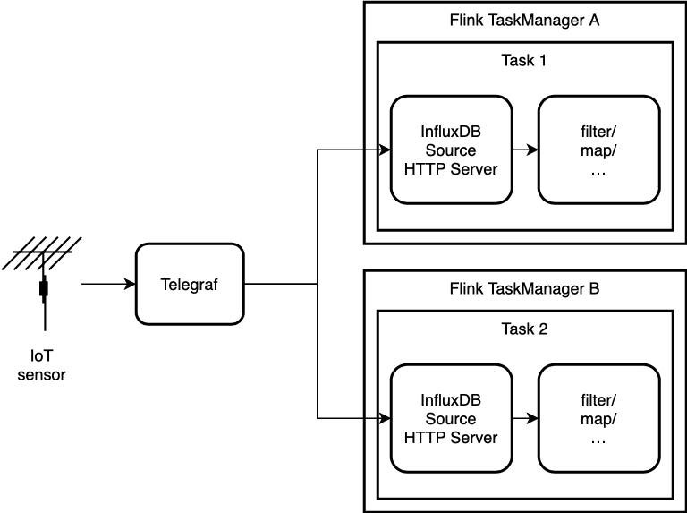

# Flink InfluxDB Connector

This connector provides a Source that parses the [InfluxDB Line Protocol](https://docs.influxdata.com/influxdb/v2.0/reference/syntax/line-protocol/) and a Sink that can write to [InfluxDB](https://www.influxdata.com/). The Source implements the unified [Data Source API](https://ci.apache.org/projects/flink/flink-docs-release-1.12/dev/stream/sources.html). Our sink implements the unified [Sink API](https://cwiki.apache.org/confluence/display/FLINK/FLIP-143%3A+Unified+Sink+API#FLIP143:UnifiedSinkAPI-SinkAPI).

## Installation

To use this connector, add the following dependency to your project:

```xml=
<dependency>
  <groupId>org.apache.bahir</groupId>
  <artifactId>flink-next-gen-connector-influxdb_2.11</artifactId>
  <version>1.1-SNAPSHOT</version>
</dependency>
```

Note that the streaming connectors are not part of the binary distribution of Flink. You need to link them into your job jar for cluster execution. See how to link with them for cluster execution [here](https://ci.apache.org/projects/flink/flink-docs-release-1.12/dev/project-configuration.html#adding-connector-and-library-dependencies).

## Compatibility

This module is compatible with InfluxDB 2.x and InfluxDB 1.8+. See more information [here](https://github.com/influxdata/influxdb-client-java#influxdb-client-java).

## Source

The Source accepts data in the form of the [Line Protocol](https://docs.influxdata.com/influxdb/v2.0/reference/syntax/line-protocol/). One HTTP server starts per SplitReader that parses HTTP requests to our Data Point class. That Data Point instance is deserialized by a user-provided implementation of our InfluxDBDataPointDeserializer and send to the next Flink operator.

When using Telegraf, you have two choices to configure it. You can either configure its [InfluxDB v2 output plugin](https://docs.influxdata.com/telegraf/v1.17/plugins/#influxdb_v2) for writing to the running HTTP servers or use its [HTTP output plugin](https://docs.influxdata.com/telegraf/v1.17/plugins/#http) for that:

```toml
[[outputs.influxdb_v2]]
  urls = ["http://task-manager-1:8000", "http:/task-manager-2:8000"]

# or

[[outputs.http]]
  url = "http://task-manager-1:8000/api/v2/write"
  method = "POST"
  data_format = "influx"
```



### Usage

```java=
InfluxDBSource<Long> influxDBSource = InfluxBSource.<Long>builder()
        .setDeserializer(new TestDeserializer())
        .build()
        
// ...

/**
 * Implementation of InfluxDBDataPointDeserializer interface
 * (dataPoint) -----> (element)
 *  test,longValue=1 fieldKey="fieldValue" -----------> 1L
 *  test,longValue=2 fieldKey="fieldValue" -----------> 2L
 *  test,longValue=3 fieldKey="fieldValue" -----------> 3L
 */
class TestDeserializer implements InfluxDBDataPointDeserializer<Long> {
    @Override
    public Long deserialize(final DataPoint dataPoint) {
        return (Long) dataPoint.getField("longValue");
    }
}
```


### Options

| Option            | Description     | Default Value     |
| ----------------- |-----------------|:-----------------:|
| ENQUEUE_WAIT_TIME | The time out in seconds for enqueuing an HTTP request to the queue. | 5 |
| INGEST_QUEUE_CAPACITY | Size of queue that buffers HTTP requests data points before fetching. | 1000 |
| MAXIMUM_LINES_PER_REQUEST | The maximum number of lines that should be parsed per HTTP request. | 10000 |
| PORT | TCP port on which the split reader's HTTP server is running on. | 8000 |

### Supported Data Types in Field Set

| Field Set     | Support       | 
| ------------- |:-------------:| 
|    Float      | ✅            |
|    Integer    | ✅            |
|    UInteger   | ❌            |
|    String     | ✅            |
|    Boolean    | ✅            |

See InfluxDB field set value [data type](https://docs.influxdata.com/influxdb/cloud/reference/syntax/line-protocol/#field-set).
 

## Sink

The Sink writes data points to InfluxDB using the [InfluxDB Java Client](https://github.com/influxdata/influxdb-client-java). You provide the connection information (URL, username, password, bucket, and organization) and an implementation of `InfluxDBSchemaSerializer<IN>` generic interface. The implementation of the interface overrides the `serialize(IN element, Context context)` function. This function serializes incoming Flink elements of type `IN` to [Point](https://github.com/influxdata/influxdb-client-java/blob/master/client/src/main/java/com/influxdb/client/write/Point.java) objects.

It is possible to write multiple data points to InfluxDB simultaneously by separating each point with a new line. Batching data points in this manner results in much higher performance. The batch size can be set through the `WRITE_BUFFER_SIZE` option. By default, the buffer size is set to 1000 and can be changed to any value using the `setWriteBufferSize(final int bufferSize)` of the Sink builder class.

### Usage

```java=
// The InfluxDB Sink uses the build pattern to create a Sink object
InfluxDBSink<Long> influxDBSink = InfluxDBSink.<Long>builder()
        .setInfluxDBSchemaSerializer(new TestSerializer())
        .setInfluxDBUrl(getUrl())           // http://localhost:8086
        .setInfluxDBUsername(getUsername()) // admin
        .setInfluxDBPassword(getPassword()) // admin
        .setInfluxDBBucket(getBucket())     // default
        .setInfluxDBOrganization(getOrg())  // influxdata
        .build();
        
// ...

/**
 * Implementation of InfluxDBSchemaSerializer interface
 * (element) -----> (dataPoint)
 *  1L -----------> test,longValue=1 fieldKey="fieldValue"
 *  2L -----------> test,longValue=2 fieldKey="fieldValue"
 *  3L -----------> test,longValue=3 fieldKey="fieldValue"           
 */
class TestSerializer implements InfluxDBSchemaSerializer<Long> {

    @Override
    public Point serialize(Long element, Context context) {
        final Point dataPoint = new Point("test");
        dataPoint.addTag("longValue", String.valueOf(element));
        dataPoint.addField("fieldKey", "fieldValue");
        return dataPoint;
    }
}
```

### Options

| Option            | Description   | Default Value   |
| ----------------- |-----------------|:-----------------:|
| WRITE_DATA_POINT_CHECKPOINT | Determines if the checkpoint data point should be written to InfluxDB or not. | false |
| WRITE_BUFFER_SIZE | Number of elements to buffer the data before writing them to InfluxDB. | 1000 |
| INFLUXDB_URL | InfluxDB Connection URL. | ❌ |
| INFLUXDB_USERNAME | InfluxDB username. | ❌ |
| INFLUXDB_PASSWORD | InfluxDB password. | ❌ |
| INFLUXDB_BUCKET | InfluxDB bucket. | ❌ |
| INFLUXDB_ORGANIZATION | InfluxDB organization. | ❌ |

## Building the connector

The connector can be built by using maven:

```bash
cd flink-next-gen-connector-influxdb
mvn clean install -DskipTests
```

## Benchmarks

Some basic benchmarks were conducted. Results of these benchmarks can be visualized [here](media/benchmarks.pdf).

## Future Work

* [Source] Dynamic (unprivileged) ports for HTTP server
* [Source] Integration with Kubernetes service discovery in conjunction with dynamic ports
* [Source] Use multi-threaded HTTP server
* [Sink] Flush write buffer after an inactivity timeout

## Contributors

<!-- ALL-CONTRIBUTORS-LIST:START - Do not remove or modify this section -->
<table>
  <tr class="noBorder">
    <td class="noBorder" align="center">
        <a href="https://github.com/1p4pk"><br /><sub><b>Leon Papke</b></sub>
         </a>
     </td>
    <td class="noBorder" align="center">
        <a href="https://github.com/raminqaf"><br /><sub><b>Ramin Gharib</b></sub>
        </a>
    </td>
    <td  class="noBorder" align="center">
    <a href="https://github.com/Shark">        <br /><sub><b>Felix Seidel</b></sub></a>
    </td>
  </tr>
</table>
<!-- ALL-CONTRIBUTORS-LIST:END -->

This project follows the [all-contributors](https://github.com/all-contributors/all-contributors) specification. Contributions of any kind welcome!
